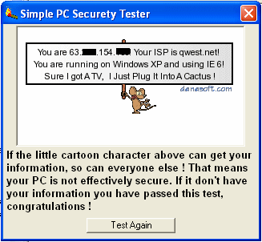



## Simple Security Tester

### Description

A simple security tester you can use to find out some of the data that your computer may be broadcasting to other computers. A lot of hard work went into this puppy, so I hope you like it ! Enjoy !!!!
 
### More Info
 

             |
---                |---
**Submitted On**   |2006-05-27 22:47:38
**By**             |[Thomas Swift](https://github.com/Planet-Source-Code/PSCIndex/blob/master/ByAuthor/thomas-swift.md)
**Level**          |Beginner
**User Rating**    |5.0 (10 globes from 2 users)
**Compatibility**  |VB 6\.0
**Category**       |[Jokes/ Humor](https://github.com/Planet-Source-Code/PSCIndex/blob/master/ByCategory/jokes-humor__1-40.md)
**World**          |[Visual Basic](https://github.com/Planet-Source-Code/PSCIndex/blob/master/ByWorld/visual-basic.md)
**Archive File**   |[Simple\_Sec1997245282006\.zip](https://github.com/Planet-Source-Code/thomas-swift-simple-security-tester__1-65487/archive/master.zip)

